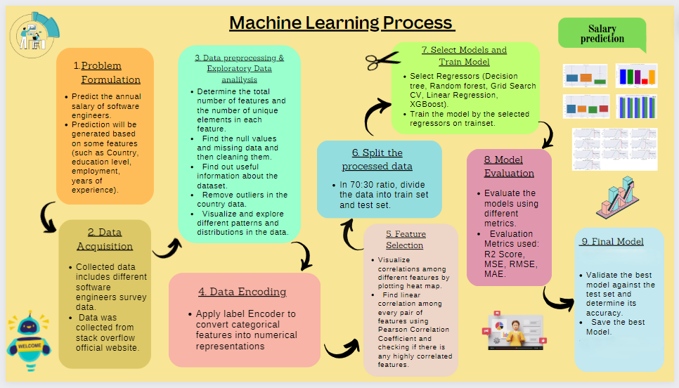
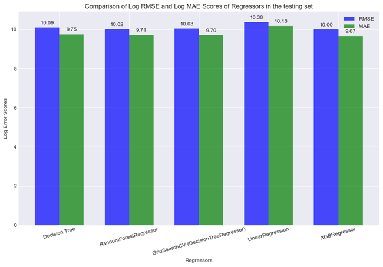
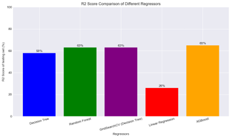

******Predictive Modeling and Analysis of Software Engineers Salary Using Machine Learning******

****Project Overview:****
This project implements machine learning models to predict the salary of software engineers based on various factors, such as education level, years of experience, employment status, and geographical location. The project uses a dataset from the Stack Overflow 2020 Developer Survey, with over 34,000 entries processed to build an accurate predictive model.

****Motivation****
The demand for software engineers is rapidly growing, and predicting their salary based on multiple variables is complex. This project aims to assist recruiters and job seekers by predicting fair salary offers using machine learning, ensuring transparency and equity in salary discussions.

****Key Feature****

**Dataset:** Data collected from the Stack Overflow 2020 Developer Survey.

**Target Prediction:** Software engineers' annual salary in USD.

**Data Attributes:**

                  Country: Name of the country.
                  EdLevel: Education level of the employee.
                  Employment: Employment status.
                  YearsCodePro: Years of professional coding experience.
                  ConvertedComp: Annual salary of the employees in USD.

****Methodology****
The methodology includes the following steps:

1.Data Preprocessing: Cleaning and preprocessing the dataset to handle missing and inconsistent data.

2.Exploratory Data Analysis: Visualizations to understand the relationships between variables, including boxplots and salary distribution graphs.

3.Data Encoding: Label encoding of categorical variables (Country, Education Level, and Employment Status).

4.Feature Selection: Analysis of correlation between features to select the most important ones for prediction.

5.Data Splitting: Splitting the dataset into 70% training and 30% test sets.

6.Modeling: Implementing multiple regression models, including:

          1.Decision Tree
          
          2.Random Forest
          
          3.GridSearchCV
          
          4.Linear Regression
          
          5.XGBoost
          
          
****Results****

**Best Performing Model:** XGBoost with an R-squared score of 72% on the training set and 65% on the test set.

**Metrics:** The model's performance was evaluated using Root Mean Squared Error (RMSE), Mean Absolute Error (MAE), and R-squared values.

**Comparisons:** Other models, such as Decision Tree and Random Forest, performed well but XGBoost gave the highest accuracy.
